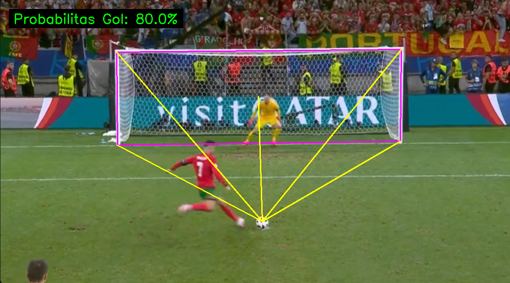

# Image-Based Football Goal Probability System



Sistem untuk memperkirakan probabilitas gol sepak bola dari **satu gambar diam** situasi tembakan, tanpa memerlukan kamera tracking mahal atau sensor tambahan. Sistem ini menggunakan konsep aljabar linier dan aljabar geometri untuk merekonstruksi geometri lapangan secara metrik dari foto tunggal.

## Latar Belakang

Model probabilitas gol konvensional (xG) membutuhkan data pelacakan spatiotemporal dari banyak kamera tersinkronisasi atau sensor yang mahal, sehingga tidak terjangkau untuk tim amatir. Sistem ini memecahkan masalah tersebut dengan memanfaatkan satu gambar statis melalui pendekatan geometri berbasis titik referensi.

---

## Struktur Proyek

```
.
├── main.py          # Entry point — orkestrasi alur utama
├── model.py         # GoalProbabilityCalculator — model logistik & faktor halangan
├── utils.py         # ImageMarker, FieldProcessor, AffineBasisTransformer
├── test.py          # Unit test
├── FIFAfield.png    # Peta lapangan 2D sebagai referensi (top-down view)
├── requirements.txt
├── input/           # Contoh gambar input (1.png – 7.png)
└── output/          # Hasil visualisasi (output_1.png – output_7.png)
```

---

## Alur Kerja

Program berjalan secara interaktif dengan 7 langkah:

```
Gambar Tembakan  ──►  Tandai titik kunci  ──►  Tandai pemain bertahan
                                                        │
Peta FIFA 2D     ──►  Tandai titik ref   ◄──────────────┘
                          │
                   Transformasi Afine  ──►  Koordinat metrik lapangan
                          │
               Hitung jarak & sudut  ──►  Model Logistik (Probabilitas Dasar)
                          │
             Hitung faktor halangan  ──►  Probabilitas Gol Akhir + Visualisasi
```

**Langkah 1** — Tandai 6 titik pada gambar tembakan:
- Bola, Kiper, Tiang Atas-Kiri, Tiang Atas-Kanan, Tiang Bawah-Kanan, Tiang Bawah-Kiri

**Langkah 2** — Tandai posisi pemain bertahan (klik semua defender, tekan `q` atau `Enter` selesai)

**Langkah 3** — Tandai 3 titik pada peta lapangan FIFA 2D:
- Bola, Tiang Kiri, Tiang Kanan

**Langkah 4** — Sistem menghitung skala (piksel/meter) dan ground truth jarak serta sudut tembakan

**Langkah 5** — Posisi defender dipetakan dari koordinat gambar ke koordinat lapangan via **Transformasi Basis Afine**

**Langkah 6** — Hitung probabilitas gol dengan dua metode:
- *Standard*: skor halangan berbasis jarak dan offset lateral
- *Wedge Product*: offset lateral dihitung menggunakan produk luar (exterior product) vektor 2D

**Langkah 7** — Gambar visualisasi (garis arah tembakan, sudut gawang, overlay persentase) dan simpan ke `output/`

---

## Konsep Matematika

| Konsep | Digunakan Untuk |
|---|---|
| **Transformasi Basis Afine** | Memetakan koordinat piksel gambar ke koordinat metrik lapangan 2D |
| **Wedge Product (Produk Luar)** | Menghitung jarak lateral defender terhadap jalur tembakan tanpa matriks rotasi |
| **Regresi Logistik** | Menghitung probabilitas dasar berdasarkan jarak dan sudut tembakan |
| **Dekomposisi Kovarians + Eigenvalue** | Menganalisis orientasi dominan tembok pertahanan (defensive wall) |
| **SVD (Singular Value Decomposition)** | Menghitung matriks homografi via Direct Linear Transformation (DLT) |

---

## Instalasi

### 1. Clone repositori

```bash
git clone https://github.com/re1nsilitonga/Image-Based-Football-Goal-Probability-System.git
cd Image-Based-Football-Goal-Probability-System
```

### 2. Buat virtual environment (opsional tapi disarankan)

```bash
python -m venv venv
source venv/bin/activate        # Linux/macOS
venv\Scripts\activate           # Windows
```

### 3. Install dependensi

```bash
pip install -r requirements.txt
```

Dependensi yang dibutuhkan:
- `numpy` — komputasi numerik dan aljabar linier
- `opencv-python` — baca gambar, tampilan interaktif, dan visualisasi
- `tk` — deteksi ukuran layar untuk auto-resize jendela

---

## Cara Menjalankan

### Jalankan program utama

```bash
python main.py
```

Program akan membuka jendela interaktif. Ikuti instruksi di terminal.

#### Input gambar kustom

Secara default program mencari `input/shot.jpg`. Jika tidak ada, program akan meminta jalur file secara manual:

```
Masukkan jalur ke Gambar Tembakan: /path/to/your/image.jpg
```

Atau letakkan gambar tembakan Anda sebagai `input/shot.jpg` sebelum menjalankan program.

#### Menggunakan gambar contoh

Gambar contoh tersedia di folder `input/` (1.png – 7.png). Salin salah satunya:

```bash
cp input/1.png input/shot.jpg
python main.py
```

### Jalankan unit test

```bash
python -m unittest test.py -v
```

Test mencakup:
- Kebenaran probabilitas dasar (jarak dekat > jarak jauh, sudut lebar > sudut sempit)
- Faktor halangan metode standard
- Faktor halangan metode eigenvalue (tembok lebih memblokir dari barisan)
- Transformasi basis afine (identitas harus menghasilkan titik yang sama)

---

## Output

Hasil disimpan di folder `output/` dengan nama `output_<nama_file_input>`.

Visualisasi menampilkan:
- Kotak gawang yang ditandai (garis merah muda)
- Garis arah tembakan dari bola ke sudut-sudut gawang dan pusat gawang (garis kuning)
- Overlay teks probabilitas gol dalam persen (pojok kiri atas)

---

## Contoh Output

| Input | Output |
|---|---|
| `input/1.png` | `output/output_1.png` |
| `input/2.png` | `output/output_2.png` |
| ... | ... |

---

## Batasan

- Akurasi bergantung pada ketepatan pengguna menandai titik referensi
- Transformasi afine mengasumsikan bidang lapangan datar (planar)
- Tidak memperhitungkan efek spin bola, kondisi cuaca, atau kelelahan pemain
